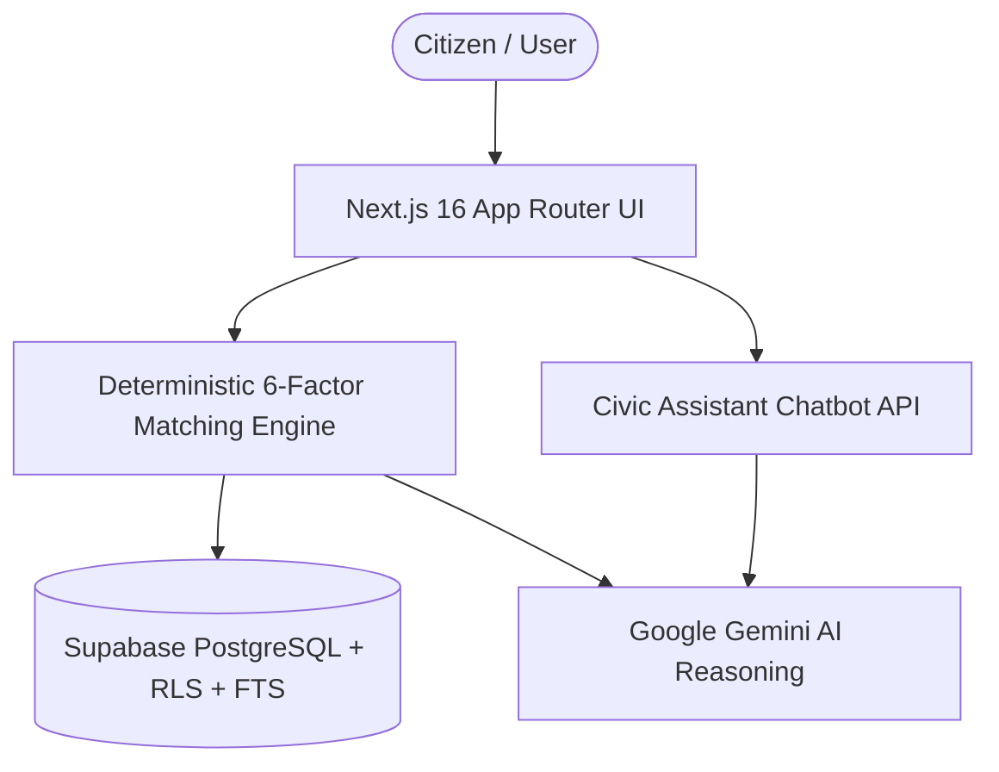

# SuchakAI (सूचक AI) — Intelligent Citizen Welfare & Scheme Discovery Platform

[](https://nextjs.org/)
[](https://reactjs.org/)
[](https://tailwindcss.com/)
[](https://ai.google.dev/)
[](https://supabase.com/)
[](LICENSE)

> **Eliminating bureaucratic discovery barriers.** SuchakAI bridges the gap between complex government schemes and the citizens who need them most—delivering real-time deterministic eligibility matching, instant plain-language AI reasoning, and an interactive civic guidance assistant.

---

## 📌 Overview

Across India, thousands of Central and State welfare initiatives remain underutilized due to fragmented information, convoluted eligibility rules, and opaque application workflows. 

**SuchakAI** is an intelligent civic-tech portal designed to make welfare access frictionless:
1. **Multi-Factor Deterministic Matching:** Evaluates profile attributes against verified eligibility rules with a weighted ranking algorithm to ensure zero fact hallucinations.
2. **Context-Aware Gemini AI Reasoning:** Breaks down complex government criteria into plain-language qualification reasons, required proofs, and potential caveats.
3. **Interactive Civic Assistant:** An embedded AI chatbot providing instant conversational answers regarding scheme benefits, required documentation, and step-by-step application procedures.
4. **Faceted Scheme Catalog:** Fast, responsive exploration across 130+ curated Central and State schemes.

---

## ⚡ Key Features

### 🎯 6-Factor Deterministic Matching Engine
- **Predictable & Accurate:** Eliminates generative hallucinations for mission-critical criteria (income ceilings, state residency, quotas, age thresholds).
- **Weighted Scoring Model:**
  - **State Match (25%):** Filters central schemes and citizen state schemes.
  - **Social Category (20%):** SC, ST, OBC, EWS, and General category reservations.
  - **Occupation (20%):** Farmers, students, artisans, entrepreneurs, unorganized workers, etc.
  - **Income Tier (15%):** Strict qualification against scheme income brackets.
  - **Demographics (10%):** Age, gender, disability, minority classifications.
  - **Freshness & Priority (10%):** Active deadlines and seasonal cycles.

### 🧠 Gemini AI Eligibility Explanations
- Generates clear, non-technical explanations highlighting **why** a citizen qualifies.
- Produces interactive verification checklists for physical documents.
- Transparently flags constraints and official portal checkpoints.

### 🤖 Intelligent Welfare Chatbot
- Context-aware virtual assistant powered by Gemini.
- Responds dynamically in conversational Hindi/English.
- Helps citizens discover schemes, understand document checklists, and locate application portals.

### 👥 Interactive Citizen Evaluation Profiles
- Pre-configured citizen profiles enabling instant end-to-end evaluation:
  - **Student Persona (Priya Sharma):** 20y SC student in Maharashtra (matches Post-Matric scholarships, MahaDBT).
  - **Agrarian Persona (Ramesh Patel):** 42y Small landholding farmer in Uttar Pradesh (matches PM-KISAN, PMAY-G, PMFBY).
  - **Entrepreneur Persona (Sunita Devi):** 32y Woman entrepreneur in Karnataka (matches Stand-Up India, MUDRA, SVANidhi).

---

## 🛠️ Architecture & Tech Stack



| Layer | Technology |
|---|---|
| **Framework** | [Next.js 16 (App Router)](https://nextjs.org/) |
| **Frontend & UI** | [React 19](https://reactjs.org/), [Tailwind CSS v4](https://tailwindcss.com/), [Lucide React](https://lucide.dev/) |
| **Artificial Intelligence** | [Google Gemini 2.0 Flash / Pro API](https://ai.google.dev/) via `@google/generative-ai` |
| **Database & Auth** | [Supabase](https://supabase.com/) (PostgreSQL with Row Level Security & Full-Text Search) |
| **Runtime & Language** | [Node.js 20+](https://nodejs.org/), [TypeScript 5](https://www.typescriptlang.org/) |

---

## 🚀 Getting Started

### Prerequisites

- [Node.js](https://nodejs.org/) (v20.0 or higher recommended)
- [npm](https://www.npmjs.com/) or [pnpm](https://pnpm.io/)
- Google Gemini API Key ([Google AI Studio](https://aistudio.google.com/))
- Supabase Project ([Supabase](https://supabase.com/)) *(Optional for local seed mode)*

### 1. Clone & Install

```bash
# Clone the repository
git clone <your-repository-url>
cd <your-repository-folder>

# Install dependencies
npm install
```

### 2. Configure Environment Variables

Create a `.env.local` file in the root directory:

```env
# Google Gemini API Key
GEMINI_API_KEY=your_gemini_api_key_here

# Supabase Configuration (Optional for mock/seed mode)
NEXT_PUBLIC_SUPABASE_URL=https://your-project.supabase.co
NEXT_PUBLIC_SUPABASE_ANON_KEY=your_supabase_anon_key
SUPABASE_SERVICE_ROLE_KEY=your_service_role_key

# Cron Security Token
CRON_SECRET=your_cron_secret_key
```

> **Note:** The platform includes an offline semantic matching fallback. If `GEMINI_API_KEY` is not provided, SuchakAI operates gracefully using internal heuristics and structured scheme data.

### 3. Database Setup (Supabase)

If using Supabase for cloud persistence:
1. Navigate to the SQL Editor in your Supabase dashboard.
2. Execute the migration file located at:
   ```
   supabase/migrations/001_initial_schema.sql
   ```
3. This applies schemas for `schemes`, `citizen_profiles`, full-text search indexes (`tsvector`), and Row Level Security (RLS) policies.

### 4. Run Development Server

```bash
npm run dev
```

Open [http://localhost:3000](http://localhost:3000) in your browser to view the application.

---

## 📂 Project Structure

```
├── app/
│   ├── layout.tsx                     # Root layout with metadata and providers
│   ├── page.tsx                       # Homepage with instant persona evaluation
│   ├── globals.css                    # Tailwind CSS v4 styling & theme tokens
│   ├── onboarding/page.tsx            # Multi-step citizen profile onboarding
│   ├── dashboard/page.tsx             # Personalized recommendations dashboard
│   ├── search/page.tsx                # Catalog exploration & faceted search
│   ├── scheme/[id]/page.tsx           # Scheme detail view & eligibility report
│   └── api/
│       ├── chat/route.ts              # Gemini conversational civic assistant API
│       ├── schemes/match/route.ts     # Multi-factor deterministic ranking endpoint
│       └── schemes/[id]/explain/route.ts # Gemini eligibility reasoning API
├── components/
│   ├── Navbar.tsx                     # Global navigation bar & profile selector
│   ├── Chatbot.tsx                    # Floating AI civic assistant widget
│   ├── SchemeCard.tsx                 # Scheme display card with match metrics
│   ├── AIEligibilityModal.tsx         # Plain-language Gemini reasoning modal
│   └── FilterSidebar.tsx              # Faceted filters (state, sector, tier)
├── lib/
│   ├── types.ts                       # TypeScript definitions for profiles & schemes
│   ├── matching.ts                    # 6-factor deterministic matching algorithms
│   ├── gemini.ts                      # Gemini API client & fallback logic
│   ├── utils.ts                       # Formatters & style helpers
│   ├── data/seed-schemes.ts           # 130+ verified Central & State schemes
│   └── supabase/                      # Supabase client configurations
├── supabase/
│   └── migrations/
│       └── 001_initial_schema.sql     # PostgreSQL DDL, FTS & RLS policies
└── docs/                              # Technical research & specifications
```

---

## 🛡️ API Endpoints

### 1. Scheme Matching Endpoint
- **Path:** `POST /api/schemes/match`
- **Description:** Evaluates a citizen profile against scheme criteria and returns weighted match scores.
- **Payload:** Citizen demographic, geographic, and income attributes.

### 2. AI Eligibility Explanation
- **Path:** `POST /api/schemes/[id]/explain`
- **Description:** Invokes Gemini to formulate a structured reasoning report with verification checkmarks and conditions.

### 3. Civic Assistant Chat
- **Path:** `POST /api/chat`
- **Description:** Natural language endpoint for citizen queries with scheme context injection.

---

## 🧪 Testing & Validation

```bash
# Run linting
npm run lint

# Production build check
npm run build
```

---

## 📄 License

This project is open-source and available under the [MIT License](LICENSE).
